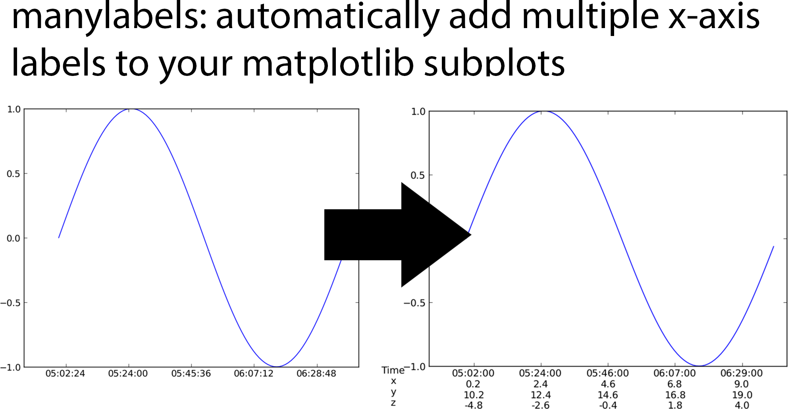

# manylabels

Many plots in the heliophysics science community are of satellites showing various physical 
observations. To place these observations in context, scientists often include multiple
x-axis labels showing, for example, the satellite location. This is surprisingly hard to implement using matplotlib. Nevertheless, `manylabels.ManyLabels()` class provides this functionality. 

## Installation

```shell
$ python -m pip install manylabels
```

## Example
```python
import numpy as np
import pandas as pd
import matplotlib.pyplot as plt
import manylabels
n = 100
x = np.array([pd.Timestamp(2000,1,1,5,0,0) + pd.Timedelta(minutes=i) for i in range(n)])
y = np.random.rand(n)

data = pd.DataFrame(
    index=x,
    data={
        'x':np.linspace(0, 10, num=n),
        'y':np.linspace(10, 20, num=n),
        'z':np.linspace(-5, 5, num=n)
        }
    )

fig, ax = plt.subplots()
ax.plot(x, y)
ManyLabels(ax, data)
plt.show()
```